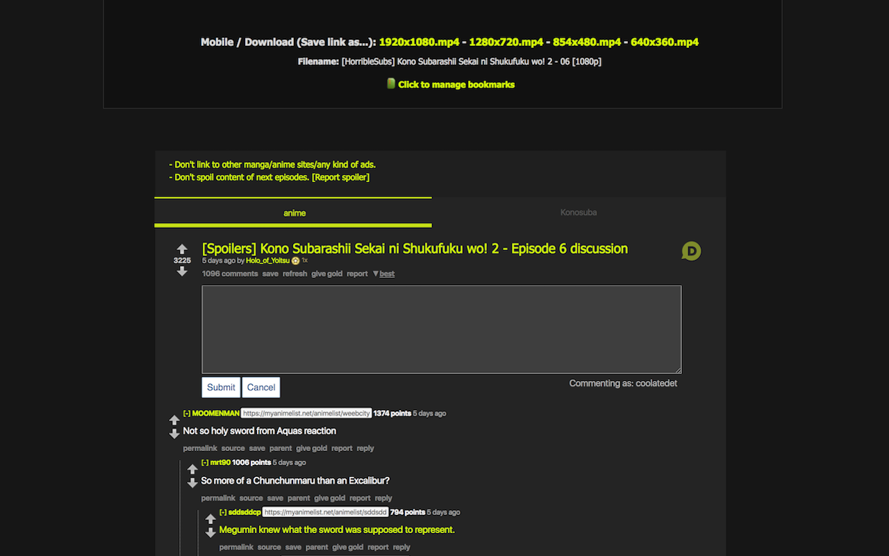
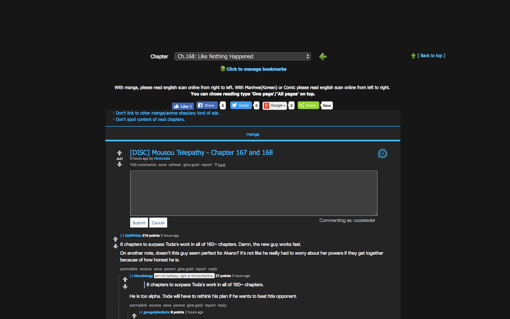

Reddit on KissAnime (RoKA)
=========


A Chrome extension that embeds Reddit comments, on KissAnime and KissManga!

Get it on the [Chrome Web Store!](https://chrome.google.com/webstore/detail/roka-reddit-on-kissanime/efhcppfepepillenpbenmefpgaikjmeb)

Original source code and inspiration from [alientube](https://github.com/xlexi/alientube/).

KissAnime            |  KissManga
:-------------------:|:--------------------:
 | 


## Installing from Source

1. Clone the git repository
```shell
git clone https://github.com/myh1000/RoKA.git
```
2. Pull the submodules
```shell
git submodule update --init --recursive --remote
```
2. Unpack and save to a secure location
3. Go to the extension list: chrome://extensions
4. Activate "Developers Mode"
5. Click "Load unpacked extension…"
6. Look for the folder with the extension and enjoy
